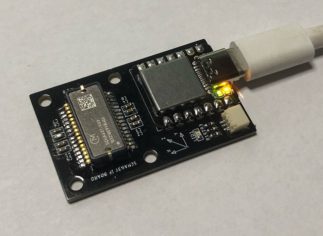

# **SCHA63T_MINI_EVK**

## **Overview**

SCHA63T_MINI_EVK is a compact USB 2.0 interface board for Murata 6 DOF MEMS-IMU
SCHA63T-K03. The IMU sensor sampling timing can be synchronized by PPS and
NMEA inputs from an external clock source.



--------------------------------------------------------------------------------

## **Package Structure**
```
SCHA63T_MINI_EVK --+-- FW      Firmware source programs for Seeeduino XIAO
                   |           (ref [3])
                   +-- HW      I/F Board CAD data and parts list for hardware
                   |           (*.brd and *.sch are for Eagle)
                   +-- doc     SCHA63T-K03 documents (ref [1][2])
```

--------------------------------------------------------------------------------

## **Installation**

* Download and install Arduino IDE to your PC by "Software Step 1" in ref [3].

* Extract PocketSDR.zip to an appropriate directory <install_dir>.

* In Arduino IDE, execute menu File - Open... and select the sketch file
<install_dir>\SCHA63T_MIN_EVK\FW\Arduino\SCHA63T\SCHA63T.ino.

* Execute menu Sketch - Verify/Compile to compile the sketch.

* Connect SCHA63T_MINI_EVK board to the PC. Reset Seeeduino XIAO by shorting
the RST pins twice to enter the boot mode.

* Execute menu Tools - Board "Seeeduino XIAO" - Seeed SAMD (32-bits ARM
Cortex-M0+ and Cortex-M4) Boards - Seeeduino XIAO.

* Execute menu Tools - Port - COMxx (Seeeduino XIAO).

* Execute menu Sketch - Upload. If you see "Verify successful" in the IDE
message window, the firmware is properly written to the board.

--------------------------------------------------------------------------------

## **Operation**

* After connecting the SCHA63T_MINI_EVK board to the PC by USB cable, the board
automatically starts to output the IMU data as the following format via the USB
serial port. The initial output data rate is 100 Hz.
```
  $IMU,<t_sync>,<time>,<Rx>,<Ry>,<Rz>,<Ax>,<Ay>,<Az>,<temp>,<stat>*<CS>\r\n

  <t_sync>   : External time sync status (0:async, 1: PPS, 2: PPS + NMEA)
  <time>     : Time tag (s) (time of day in UTC for <t_sync> = 2)
  <Rx>,<Ry>,<Rz> : Gyroscope X,Y,Z data (deg/H)
  <Ax>,<Ay>,<Az> : Accelerometer X,Y,Z data (g)
  <temp>     : Sensor temperature (C)
  <stat>     : Sensor summary status (HEX) (0: OK, 1: error)
               bit 6-4: Rx,Ry,Rz, bit 2-0: Ax,Ay,Az
  <CS>       : Checksum same as NMEA
```

* By inputting PPS and NMEA signals via the external sync connector of the
board, the sampling timing of the IMU can be synchronized to the external
clock source. The pin assignment of the external sync connector is as follows.
Without the sync signals, the sampling is done by the internal clock.
```
  JST SH 3P (TOP VIEW)
  +-------+
  | pin 3 | <---- NMEA (3.3V, 9600 bps, GxGGA or GxRMC)
  | pin 2 | <---- PPS  (3.3V, rising edge)
  | pin 1 | ----- GND
  +-------+
```

* By sending commands to the board via the USB serial port, some IMU or
sampling parameters can be configured. The commands are as follows. The max
data rate is 200 Hz.
```
  reset                        : Reset device.
  device                       : Show device information.
  start                        : Start output data.
  stop                         : Stop output data.
  status                       : Show status.
  rate [<rate>]                : Set output data rate (Hz).
  range [<range_g> <range_a>]  : Select dynamic range gyro/accel.
                                 (0:300deg/H or 6g, 1:150deg/H or 1.5g)
  filter [<filt_g> <filt_a>]   : Select filter gyro/accel.
                                 (0:13Hz, 1:20Hz, 2:46Hz, 3:200Hz, 4:300Hz)
  table                        : Show cross-axis compensation table.
  read {DUE|UNO} [<addr>]      : Read device register(s). (addr:HEX)
  write {DUE|UNO} <addr> <val> : Write device register. (addr/val:HEX)
  debug [<level>]              : Set debug level. (0:no debug)
  help                         : Show command help.
```

--------------------------------------------------------------------------------

## **References**

[1] Murata, SCHA63T-K03 Data Sheet, Rev 1, 2021

[2] Murata, Assembly instructions for SCHA600 series Technical Note Rev 1.0, 2021

[3] Seeed Wiki, Getting Started with Seeeduino XIAO
(https://wiki.seeedstudio.com/Seeeduino-XIAO)

--------------------------------------------------------------------------------

## **History**

- 2022-03-11  1.0  1st version

